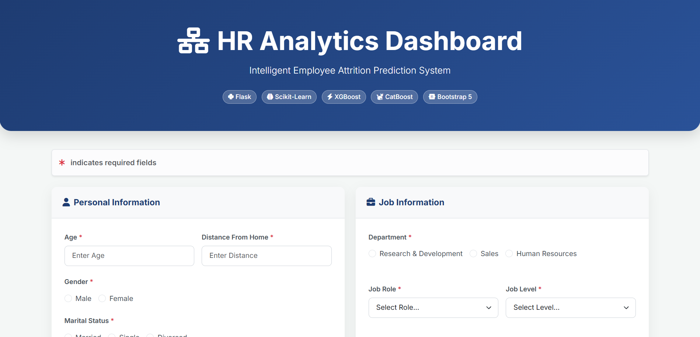
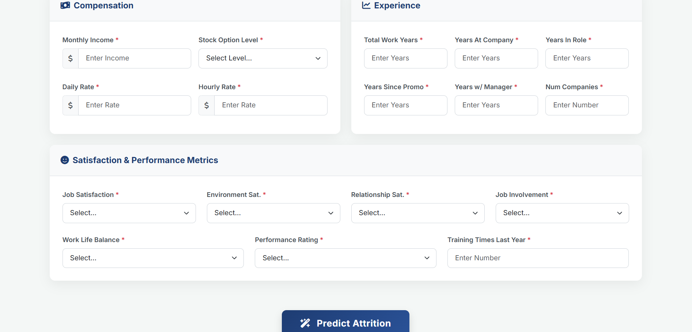
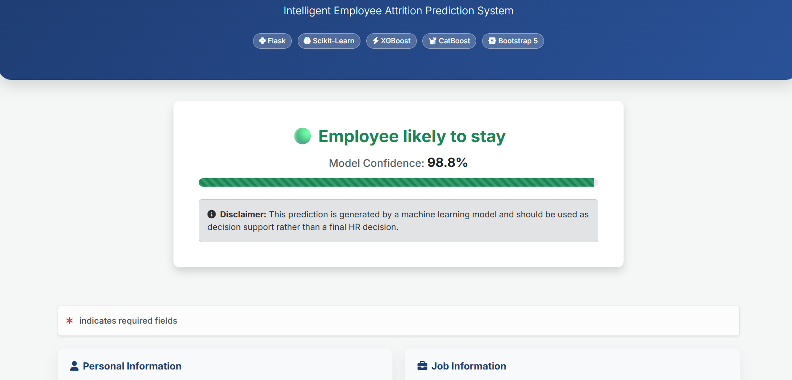
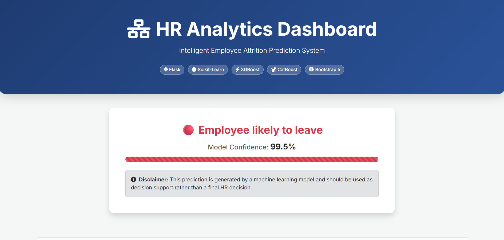

# Employee Attrition Prediction

A production-ready Machine Learning web application that predicts whether an employee is likely to leave an organization using multiple classification algorithms and an end-to-end Scikit-Learn pipeline.

**Developed by:** Mahi Agrawal


---

# Project Overview

Employee attrition is a major challenge for organizations because replacing experienced employees is both time-consuming and expensive. This project leverages the **IBM HR Analytics Employee Attrition & Performance** dataset to build an intelligent prediction system that identifies employees who are likely to leave the company.

The application compares multiple machine learning models, automatically selects the best-performing model, and serves predictions through an interactive Flask web interface.

---

# Highlights

- End-to-end Machine Learning pipeline
- Automated model comparison
- Pipeline-based preprocessing
- Interactive Flask web application
- Feature importance visualization
- Responsive Bootstrap interface
- Confidence score prediction
- Clean production-style project structure

---

# Features

- **End-to-End ML Pipeline** using Scikit-Learn Pipeline and ColumnTransformer
- **Automatic Model Comparison**
  - Logistic Regression
  - Random Forest
  - XGBoost
  - CatBoost
- **Comprehensive Evaluation**
  - Accuracy
  - Precision
  - Recall
  - F1 Score
  - ROC-AUC
  - Confusion Matrix
  - Classification Report
- **Feature Importance Visualization**
- **Interactive Prediction Interface**
- **Reusable Production Pipeline**
- **Clean Flask Architecture**

---

# Tech Stack

| Component | Technology |
|-----------|------------|
| Language | Python |
| Machine Learning | Scikit-Learn, XGBoost, CatBoost |
| Backend | Flask |
| Data Processing | Pandas, NumPy |
| Visualization | Matplotlib |
| Serialization | Joblib |
| Frontend | HTML, CSS, Bootstrap |
| Deployment | Gunicorn, Heroku |

---

# Folder Structure

```text
Employee-Attrition-Prediction/
│
├── app.py
├── train.py
├── utils.py
├── pipeline.pkl
├── requirements.txt
├── Procfile
├── README.md
├── LICENSE
├── SECURITY.md
├── Attrition.ipynb
│
├── data/
│   └── WA_Fn-UseC_-HR-Employee-Attrition.csv
│
├── static/
│   └── feature_importance.png
│
└── templates/
    └── index.html
```

---

# Installation

### Clone Repository

```bash
git clone https://github.com/YOUR_USERNAME/Employee-Attrition-Prediction.git

cd Employee-Attrition-Prediction
```

### Create Virtual Environment

```bash
python -m venv venv
```

Windows

```bash
venv\Scripts\activate
```

Linux / macOS

```bash
source venv/bin/activate
```

### Install Dependencies

```bash
pip install -r requirements.txt
```

### Download Dataset

Download the IBM HR Analytics Employee Attrition dataset from Kaggle and place it inside:

```text
data/
```

### Train Model

```bash
python train.py
```

Training will:

- Compare multiple models
- Evaluate performance
- Save the best model as `pipeline.pkl`
- Generate Feature Importance visualization

### Run Application

```bash
python app.py
```

Open

```
http://localhost:5000
```

---

# Usage

1. Open the web application.
2. Enter employee information.
3. Click **Predict**.
4. View the predicted attrition result along with confidence score.

---

# Model Performance

The project trains and compares multiple machine learning models and automatically selects the best-performing model based on the **ROC-AUC** score.

| Model | Accuracy | Precision | Recall | F1-Score | ROC-AUC |
|--------|----------|-----------|--------|----------|----------|
| Logistic Regression | **78.57%** | **39.74%** | **65.96%** | **49.60%** | **79.97%** |
| Random Forest | 82.31% | 43.24% | 34.04% | 38.10% | 78.76% |
| XGBoost | 80.61% | 35.29% | 25.53% | 29.63% | 74.75% |
| CatBoost | 81.63% | 41.86% | 38.30% | 40.00% | 73.61% |

### Best Model

**Logistic Regression** achieved the highest **ROC-AUC score (79.97%)** and was automatically selected as the final model for deployment.

**Final Model Performance:**

- **Accuracy:** 78.57%
- **Precision:** 39.74%
- **Recall:** 65.96%
- **F1-Score:** 49.60%
- **ROC-AUC:** 79.97%

---

# Screenshots

## Home Page

| Homepage 1 | Homepage 2 |
|------------|------------|
|  |  |

---

## Prediction Results

| Employee Likely to Stay | Employee Likely to Leave |
|--------------------------|--------------------------|
|  |  |

---

# Project Workflow

```text
Employee Information
        │
        ▼
Flask Web Application
        │
        ▼
Scikit-Learn Pipeline
        │
        ├── Feature Engineering
        ├── Column Transformer
        ├── One-Hot Encoding
        └── Best ML Model
                │
                ▼
Employee Attrition Prediction
```

---

# Skills Demonstrated

- Machine Learning
- Feature Engineering
- Data Preprocessing
- Classification Algorithms
- Model Evaluation
- Flask Development
- Scikit-Learn Pipelines
- Joblib Serialization
- Data Visualization
- Bootstrap UI Development

---

# Future Improvements

- Deploy using Render or AWS
- Explain predictions using SHAP
- Store prediction history in a database
- Export prediction reports


---

# Dataset

IBM HR Analytics Employee Attrition & Performance Dataset

- 1470 employee records
- 35 employee-related features
- Binary classification problem


